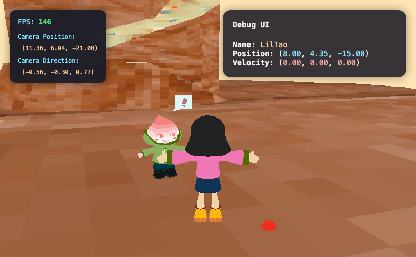

# Welcome to Tiramysu Land!

An experimental project with three.js and Typescript to create a little interactive dessert-themed world for my personal website.

To-Dos:
- Implement diegetic UI popups for content
- Scene management (theatre vs. world)
- GUI (links, pose mode, mute)
- Loading screen
- Message in a bottle system
- Animations
- Fix texture sizing for environment
- Add OnGround check and put jumping back in
- Shaders for water
- Synthesizers with Web Audio API for SFX and ambience

Completed Features:
- Dialogue system and dialogue UI
- Event emitter pattern
- Debug utilities
- Overall project structure (engine, entities, world, constants, etc.)
- Learned how to instantiate objects and add textures
- Drew objects to the screen
- Player controller (abeto-style)
- Collision, collision resolution, gravity
- Player model